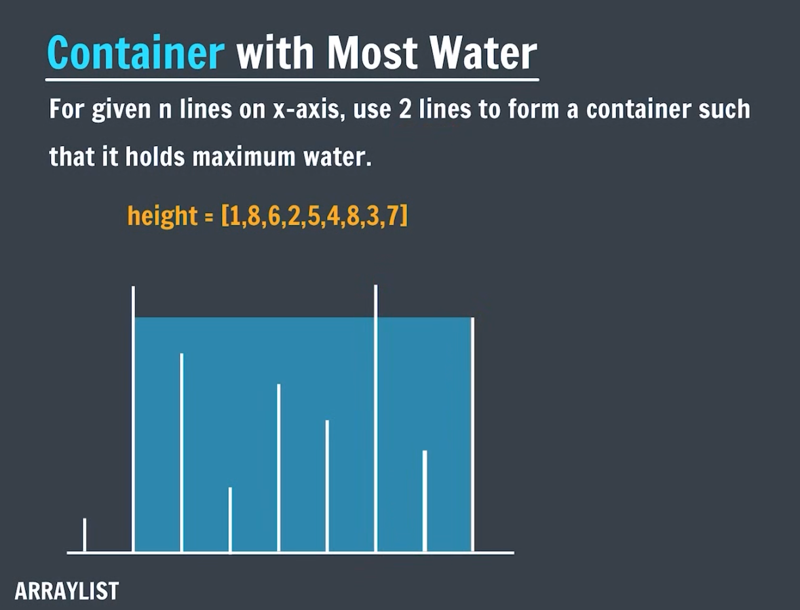

# Day 22 – Introduction to `ArrayList` in Java

Today I explored the **`ArrayList`** class in Java’s Collections Framework, learned its key operations, and practiced a variety of real-world problems using both brute-force and optimized approaches.

---

## 🔹 What Is `ArrayList`?

* A **resizable array** implementation of the `List` interface.
* Stores elements in contiguous memory but **automatically grows** when capacity is exceeded.
* Allows **duplicate** elements and maintains **insertion order**.

## 🔹 Key Operations on `ArrayList`

1. **Initialization**

   ```java
   ArrayList<Integer> list = new ArrayList<>();
   ArrayList<String> names = new ArrayList<>(Arrays.asList("Alice","Bob"));
   ```
2. **Add & Remove**

   ```java
   list.add(10);
   list.add(1, 20);      // insert at index
   list.remove(Integer.valueOf(10));
   list.remove(1);       // remove at index
   ```
3. **Access & Update**

   ```java
   int x = list.get(2);
   list.set(2, 99);
   ```
4. **Size & Emptiness**

   ```java
   int size = list.size();
   boolean empty = list.isEmpty();
   ```
5. **Iteration**

   * Traditional `for` loop, enhanced `for`, and `Iterator`.
6. **Sorting & Searching**

   ```java
   Collections.sort(list);                       // ascending
   Collections.sort(list, Comparator.reverseOrder());
   boolean found = Collections.binarySearch(list, 42) >= 0;
   ```

---

## Programs Practiced

| Filename                        | Description                                                                    |
| ------------------------------- | ------------------------------------------------------------------------------ |
| [`a_ArrayList.java`](./a_ArrayList.java)              | Initialized, added, removed, accessed elements; checked `size()`               |
| [`b_PrintReverse.java`](./b_PrintReverse.java)           | Printed elements in reverse order using a `for` loop                           |
| [`c_FindMaximum.java`](./c_FindMaximum.java)            | Found maximum value via traversal                                              |
| [`d_SwapNumbers.java`](./d_SwapNumbers.java)            | Swapped two elements using `set()`                                             |
| [`e_SortingArrayList.java`](./e_SortingArrayList.java)       | Sorted in ascending & descending using `Collections.sort()` and a `Comparator` |
| [`f_MultiDArrayList.java`](./f_MultiDArrayList.java)        | Created a 2D `ArrayList` (`ArrayList<ArrayList<T>>`) and displayed it          |
| [`g_ContainerWithMostWater.java`](./g_ContainerWithMostWater.java) | Brute-force solution to max-water container problem (photo problem statement)  |
| [`h_OptimizedG.java`](./h_OptimizedG.java)             | Two-pointer approach for container with most water                             |
| [`i_PairSum1.java`](./i_PairSum1.java)               | Brute-force check for target pair sum in sorted list                           |
| [`j_OptimizedI.java`](./j_OptimizedI.java)             | Two-pointer approach for pair sum in sorted list                               |
| [`k_PairSum2.java`](./k_PairSum2.java)               | Two-pointer approach for pair sum in a **sorted & rotated** list               |

---

## Extended Descriptions

### Container With Most Water (Brute Force vs Two-Pointer)


<br>
**Problem**: Given `n` vertical lines on the x-axis (represented by heights in a list), find two lines that together with the x-axis form a container that holds the maximum water.

* **Brute Force** (`g_ContainerWithMostWater.java`): Check every pair of lines, compute area = `(j - i) * min(height[i], height[j])`, track maximum → O(n²) time.
* **Optimized** (`h_OptimizedG.java`): Two-pointer technique—start at ends, move the pointer at the shorter line inward, update max area each step → O(n) time.

### Pair Sum Variants

* **Sorted List** (`i_PairSum1.java` & `j_OptimizedI.java`): Two-pointer scan from ends to find a target sum in O(n) vs O(n²).
* **Sorted & Rotated List** (`k_PairSum2.java`): Find pivot then use modified two-pointer across wrap-around boundary in O(n).

---

## Key Takeaways

* `ArrayList` offers dynamic resizing with array-like performance.
* Familiarity with **add**, **remove**, **get**, **set**, and **sort** operations is crucial for handling list-based problems.
* Two-pointer patterns elegantly optimize brute-force approaches for container and pair-sum problems.

---