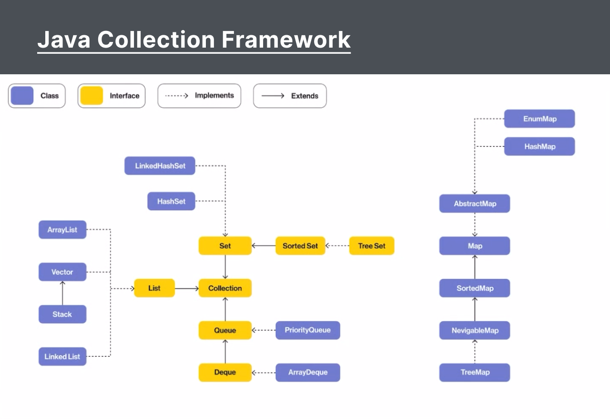

# Day 24 – Linked List Loops & Java Collections Framework

Today I learned advanced linked list operations—**detecting and removing cycles**—and explored Java’s **Collection Framework**, including its built-in `LinkedList` implementation.

---

## 🔹 Cycle Detection in Linked List

* **Problem**: A linked list has a cycle if a node’s `next` points to a previous node, creating an infinite loop.
* **Floyd’s Tortoise and Hare Algorithm** (`isCycle`):

  1. Initialize two pointers, `slow` and `fast`, both at `head`.
  2. Move `slow` one step and `fast` two steps in each iteration.
  3. If `slow == fast` at any point, a cycle exists.
  4. If `fast` or `fast.next` becomes `null`, no cycle.

```java
public static boolean isCycle() {
    Node slow = head, fast = head;
    while (fast != null && fast.next != null) {
        slow = slow.next;
        fast = fast.next.next;
        if (slow == fast) return true;
    }
    return false;
}
```

---

## 🔹 Removing a Cycle

* After detecting a cycle, find the **start of the loop** and break it:

  1. Once `slow == fast`, reset `slow` to `head`.
  2. Move both pointers one step until `slow.next == fast.next`.
  3. Set `fast.next = null` to remove the loop.

```java
public static void removeCycle() {
    Node slow = head, fast = head;
    boolean cycle = false;
    while (fast != null && fast.next != null) {
        slow = slow.next;
        fast = fast.next.next;
        if (slow == fast) { cycle = true; break; }
    }
    if (!cycle) return;
    slow = head;
    Node prev = null;
    while (slow != fast) {
        slow = slow.next;
        prev = fast;
        fast = fast.next;
    }
    prev.next = null;
}
```

---

## 🔹 Java Collections Framework (JCF)

The JCF provides standardized **interfaces**, **implementations**, and **algorithms** for working with groups of objects. Key components:

1. **Interfaces**: `Collection`, `List`, `Set`, `Queue`, `Map`.
2. **Implementations**:

   * **`ArrayList`**, **`LinkedList`** (List)
   * **`HashSet`**, **`TreeSet`** (Set)
   * **`PriorityQueue`**, **`Deque`** (Queue)
   * **`HashMap`**, **`TreeMap`** (Map)
3. **Algorithms**: utility methods in `Collections` (e.g., `sort`, `reverse`, `shuffle`).


<br>
---

## 🔹 Using `LinkedList` in JCF

* A doubly-linked list implementation of the `List` and `Deque` interfaces.
* **Key Methods**:

  ```java
  LinkedList<Integer> ll = new LinkedList<>();
  ll.addFirst(0);
  ll.addLast(1);
  ll.removeFirst();
  ll.removeLast();
  ll.get(0);
  ll.size();
  ```
* **Use Cases**: When frequent insertions/removals at both ends are needed.

```java
public class LinkedListJCF {
    public static void main(String[] args) {
        LinkedList<Integer> ll = new LinkedList<>();
        ll.addLast(1);
        ll.addLast(2);
        ll.addFirst(0);
        System.out.println(ll);         // [0, 1, 2]
        ll.removeFirst();
        ll.removeLast();
        System.out.println(ll);         // [1]
    }
}
```

---

## Programs Practiced

| Filename             | Description                                       |
| -------------------- | ------------------------------------------------- |
| [`LinkedList.java`](./LinkedList.java)    | Manual linked list with cycle detection & removal |
| [`LinkedListJCF.java`](./LinkedListJCF.java) | JCF `LinkedList` usage demo (add/remove/print)    |

---

## Key Takeaways

* **Floyd’s algorithm** efficiently detects and locates loops in O(n) time and O(1) space.
* Breaking a cycle requires precise pointer repositioning to maintain list integrity.
* JCF’s `LinkedList` offers a robust, ready-made doubly-linked list with O(1) insertions/removals at both ends.

---
